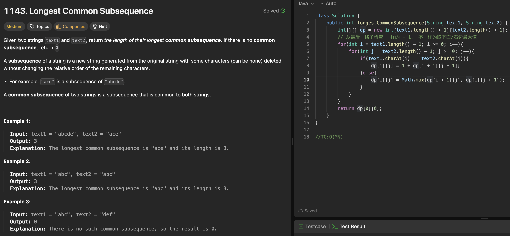

# 1143. Longest Common Subsequence

刷题日期：2026-4-1  
难度：Medium
标签：dp

---

## 题目截图

---

## 解题思路

👉 本质：** 依赖grid问题 依赖关系来把整个gridfill: 从最后一个反到第一个格子 **

- 创建dp[m+1】【n+1】
- 第一排第一列是【0，m】【0，n】
- ij相同时+1，不同时取左/左上/上最大值
- return dp[0][0]
- TC:O(MN)

👉 核心思想：

> 依赖关系
> 找到规律 填写grid
> lc72

---
