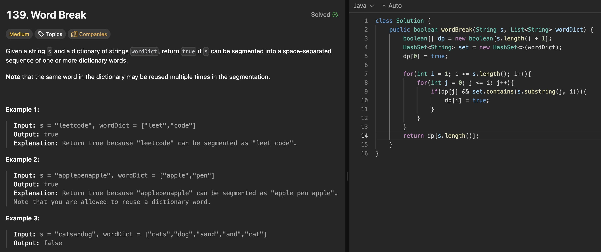

# 139 word break

刷题日期：2026-4-7
难度：Medium
标签：dp

---

## 题目截图

---

## 解题思路

👉 本质：** nested loop **

1. definition：vector里是否存在substring到当前index
2. nested loop: i[0, s.length()] j[0, wordDict.size()]

👉 核心思想：

> lc 279: perfect squares/ coin change

---
