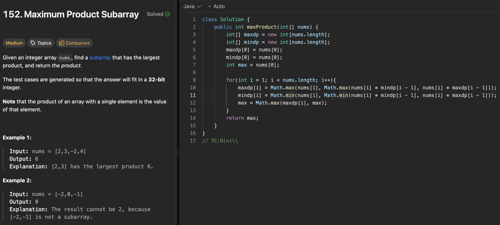

# 152. Maximum Product Subarray

刷题日期：2026-03-30  
难度：Median
标签：dp

---

## 题目截图

---

## 解题思路

👉 本质：** 算全局最大/最小 找到target**

- 创建全局最大， 全局最小
- 从1 开始update 直到最后
- return target

👉 核心思想：

> update target问题

---
