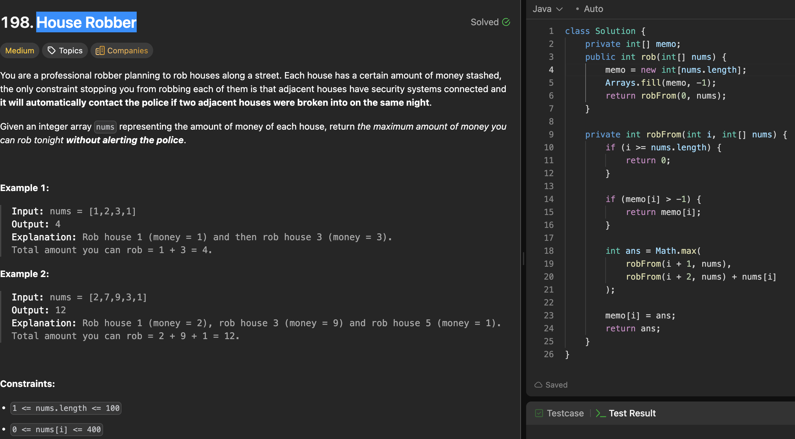

# 198. House Robber

刷题日期：2026-03-30  
难度：Median
标签：dp

---

## 题目截图

---

## 解题思路

👉 本质：** 带限制的斐波那契 **

- recursion + memo
  - Arrays(memo, -1)
  - base case: i > n return 0, build up from the end
  - return memo[i] if memo[i] != -1 //memo : aviod repeated calculation
- int ans = Math.max(robFrom(i + 1, nums),
  robFrom(i + 2, nums) + nums[i]);

👉 核心思想：

> 所有选择 → 选最大的

---
