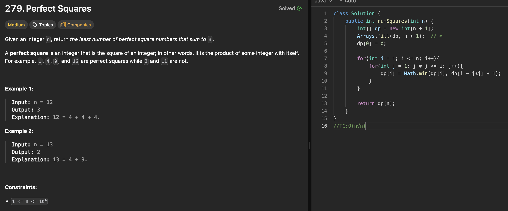

# 279. Perfect Squares

刷题日期：2026-4-1  
难度：Medium
标签：dp

---

## 题目截图

---

## 解题思路

👉 本质：** 找最少值 平方数 凑数 **

- 创建+fillin dp[amount + 1] // impossible amount
- dp[0] = 0
- i[1,amount]; j[0, j^2 less than i]
  - dp[i] = Math.min(dp[i], dp[i - coins[j]] + 1)
- return dp[n];
- TC:O(n√n)

👉 核心思想：

> 找最少值 dp[i] = Math.min(dp[i], dp[i - coins[j]] + 1)
> lc 322: coin change

---
