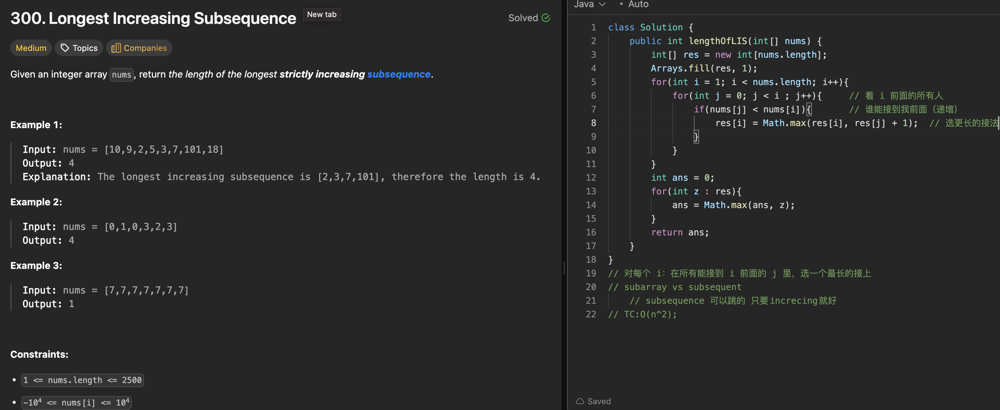

# 300. Longest Increasing Subsequence

刷题日期：2026-03-30  
难度：Median
标签：dp

---

## 题目截图

---

## 解题思路

👉 本质：** Longest Increasing Subsequence**

- nested loop
  - outer loop: to check all elements before index i [1,n]
  - inner loop: to check all elements before index j [0,i]
    - update if nums[j] < nums[i]
    - update dp[i] = max(dp[i], dp[j] + 1)

👉 核心思想：

> subarray vs subsequent
> subsequence 可以跳的 只要increcing就好

---
