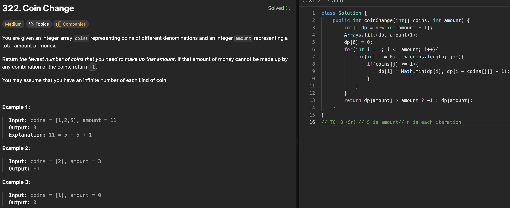

# 322. Coin Change

刷题日期：2026-4-1  
难度：Medium
标签：dp

---

## 题目截图

---

## 解题思路

👉 本质：** 找最少值硬币 凑数 **

- 创建dp[amount + 1] // impossible amount
- dp[0] = 0
- i[1,amount]; j[0, coins.length]
  - if(coins[j] <= dp[i])
    - dp[i] = Math.min(dp[i], dp[i - coins[j]] + 1)
- return dp[amount] > amount ? -1 : dp[amount];
- TC:O(amount\*coins.length)

👉 核心思想：

> lc 279: perfect squares

---
