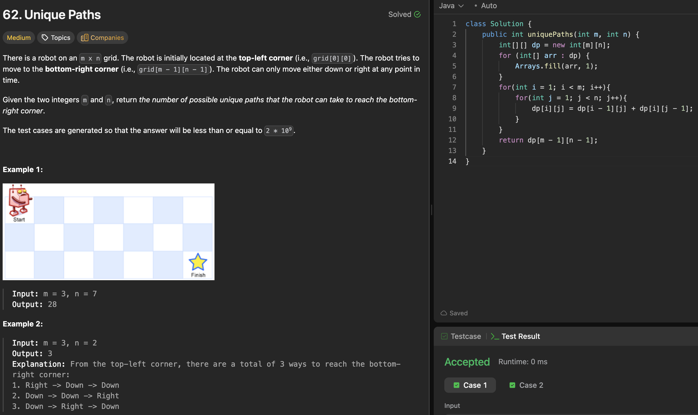

# 62. Unique Paths

刷题日期：2026-03-31
难度：Medium
标签：dp

---

## 题目截图

---

## 解题思路

👉 本质：** grid只依赖右边和下面的路径数目 **

- 第一排 第一列都是1
- 其他的都依赖于左边和上面的
- return dp[m-1][n-1]
- TC:O(MN)

👉 核心思想：

> single source shortest sum
> similar to lc64-minimum-path-sum.md

---
