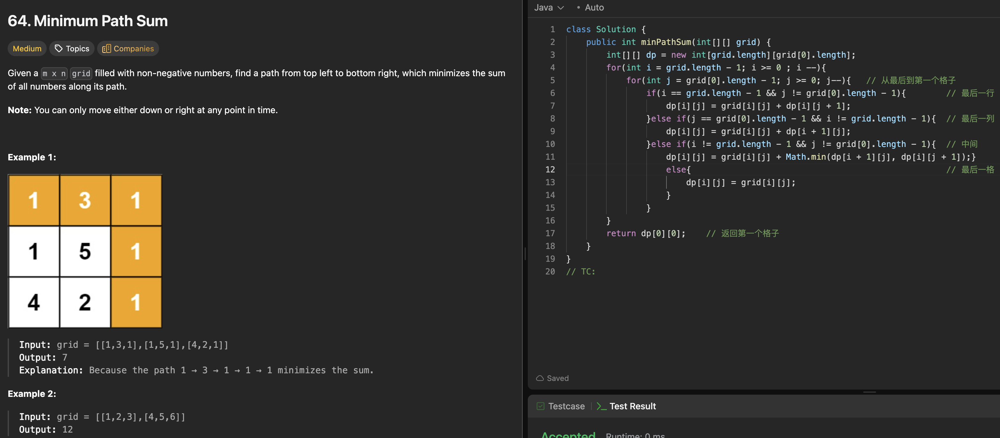

# 64. Minimum Path Sum

刷题日期：2026-03-31
难度：Median
标签：dp

---

## 题目截图

---

## 解题思路

👉 本质：** dp=到目前这个位置的最少和**

- 从最后一个格子开始算 最后格子到当前index 的最少sum
  - 最后一行永远只加右边的
  - 最后一列只加下面的
  - 最后一格保持不变
  - 中间的就取Math.min(dp[i][j+1], dp[i+1][i])
- return dp[0][0]

👉 核心思想：

> single source shortest sum

---
