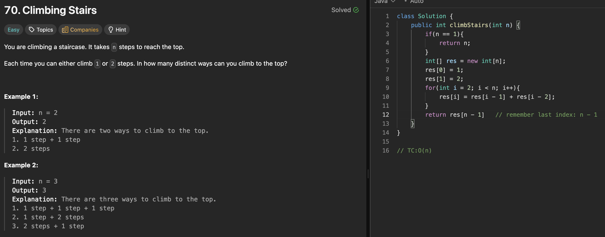

# 70. Climbing Stairs

刷题日期：2026-03-30  
难度：Easy
标签：dp

---

## 题目截图

---

## 解题思路

👉 本质：** dp fibonnaci program 每一步是到达这一步的路径数目**

- 创建dp[0], dp[1]
- dp[i] = dp[i-1] + dp[i-2]
- return dp[n - 1];

👉 核心思想：

> dp问题题目是啥我就定义是啥
> 所有到达 i 的路径 = 所有到达 i-1 的路径 + 所有到达 i-2 的路径

---
