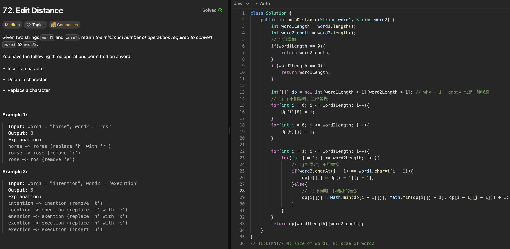

# 72. Edit Distance

刷题日期：2026-4-1  
难度：Medium
标签：dp

---

## 题目截图

---

## 解题思路

👉 本质：** 依赖grid问题 依赖关系来把整个gridfill**

- 创建dp[m+1】【n+1】
- 第一排第一列是【0，m】【0，n】
- ij相同时不变，不同时取左/左上/上最小值 + 1
- return dp[m][n]
- TC:O(MN)

👉 核心思想：

> 依赖关系
> 找到规律 填写grid
> lc1143 最长公共子序列 依赖关系 从最后一个反到第一个

---
