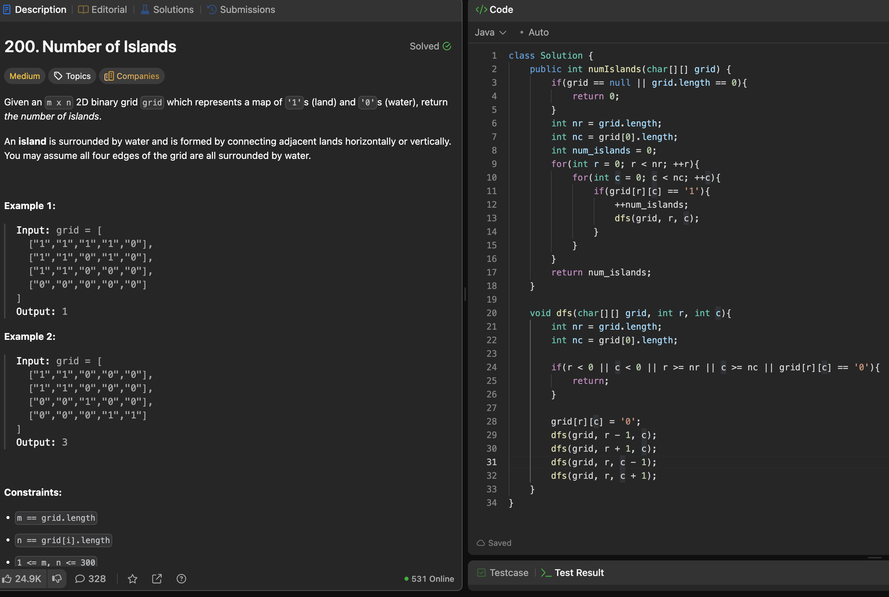

# 200. Number of Islands

刷题日期：2026-03-30  
难度：Medium  
标签：Graph

---

## 题目截图

---

## 解题思路

👉 本质：**数连通块（Connected Components）**

- 遍历整个 grid
- 遇到一个 `'1'` → 说明发现新岛屿
- count++
- 用 DFS/BFS 把整个岛“淹掉”（标记成 `'0'`）

👉 核心思想：

> 每个岛只被访问一次

---
