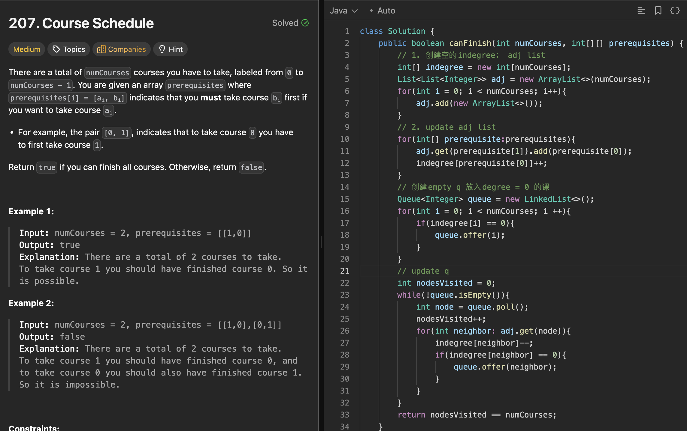

# 207. Course Schedule

刷题日期：2026-03-30  
难度：Medium  
标签：Graph

---

## 题目截图

---

## 解题思路

👉 本质：** Topological sort using Kanh algo **

- 创建empty indegree array, empty adj list
- update adj list using prerequisites
- create empty queue, add all nodes with indegree 0 to queue
- update queue by popping out nodes with indegree 0, and decrementing indegree of adjacent nodes
- return true if queue is empty, else false

👉 核心思想：

> top sort size == numCourses -> not cyclic
> top sort size < numCourses -> cyclic[its a DAG]

---
