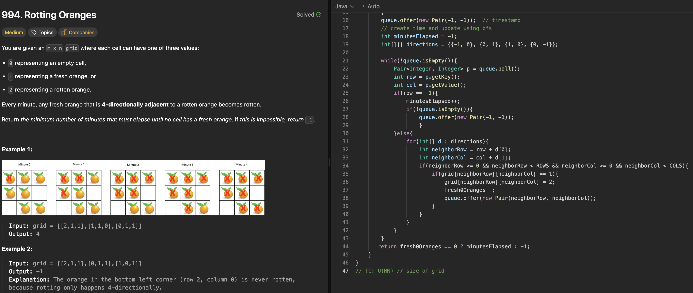

# 207. Course Schedule

刷题日期：2026-03-30  
难度：Medium  
标签：Graph

---

## 题目截图

---

## 解题思路

👉 本质：** bfs to count time **

- count # of fresh Orange + # of rotten Orange
- bfs to count time
  - create bfs queue to store rotten Oranges
  - adding (-1, -1) indicate each round
  - if not -1, meaning its a rotten Orange, contaminate neighbors, add to queue
- return time if fresh Orange == 0, else -1

👉 核心思想：

> bfs层便利 不适合dfs

---
